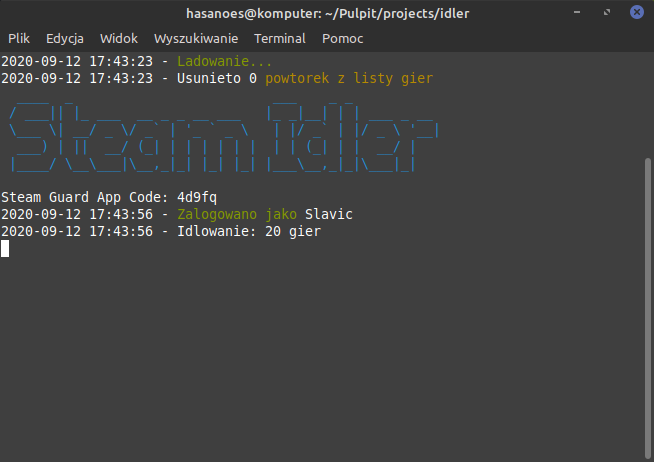

# Steam Idler
> Idlowanie godzin na Steamie.

[](https://discord.gg/H4ektqg)

Wbijaj godziny w grach nawet nic nie robiąc!



## INstalacja

1. Pobierz repozytorium

```bash
git clone https://github.com/PolandBOX/steam-idler.git
```
2. Zainstaluj moduły

```bash
npm install
```
3. Zmień nazwę configu i go wypełnij.

4. Uruchom program

```bash
npm start
```

---

# Odwiedź moje social media!
[][youtube]
[][twitter]
[][instagram]


[twitter]: https://twitter.com/hasanoes
[youtube]: https://youtube.com/polandbox
[instagram]: https://instagram.com/sebus_997
